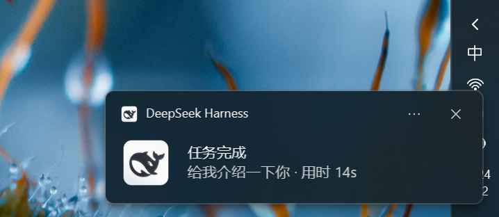
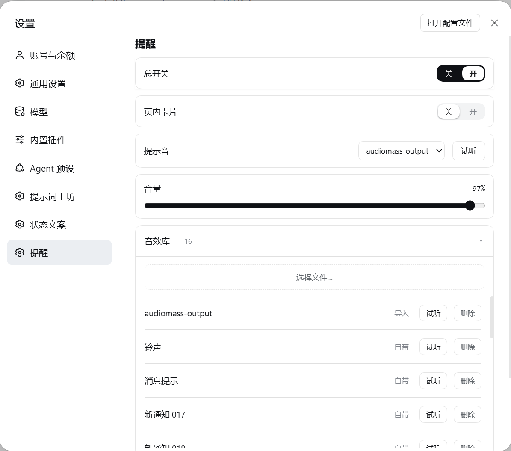

# dsh-donevoice 🔔

**DSH 的完成提醒官。** 你切去别的窗口干活时，DSH 里的任务**完成 / 等你审批 / 等你回答 / 执行失败**，它就用 **Windows 系统通知**（屏幕右下角）+ 一声提示音叫你，**点一下就回到那个会话**。

> 提醒由 **DSH 宿主进程**发出，不依赖页面——DSH 最小化、切到别的页面、标签被冻住，都照样能收到。

## 功能

| | 什么时候提醒 | 通知内容 |
|---|---|---|
| 🟢 | **任务完成** | 「任务完成」+ 会话名 + 本次耗时 |
| 🟡 | **等你审批** | 「等待你的许可」+ 工具名 + 理由 |
| 🔵 | **等你回答** | 「需要你的回答」+ 第一个问题 |
| 🔴 | **执行失败** | 「执行失败」+ 错误摘要；提示音是**下行**的，一听就知道不对 |

- **点通知 = 回到那个会话**，DSH 没在跑就帮你启动它。
- **正看着 DSH 时不弹**（你在看屏幕，提醒多余），切走之后才弹——这是定稿行为，不是开关。
- 子代理**不提醒**（会刷屏），只由主管会话提醒一次。
- **不联网**、不上传任何内容；不订阅审批链，结构上不可能卡住审批。

真机效果——Windows 通知中心里的系统通知，带图标、会话名与本次耗时：



## 系统要求

**仅 Windows 10 / 11**，DSH 桌面版 **0.2.0-rc.2**。通知走 Windows 通知中心、点击回跳走 `donevoice://` 协议，都是 Windows 专有——**macOS / Linux 上装了不会有任何反应**。不需要管理员权限。

## 快速开始

**1. 安装** —— DSH → **设置 → 插件 → 添加插件**，粘这一行：

```
github:zywnb-2/dsh-donevoice#v1.1.3
```

> **`#` 后面的版本号别删**，它把安装锁定到对应的发布 tag；不写就跟随随时会变的 `main`。
> 命令行等价写法：`dsh plugin --profile desktop add github:zywnb-2/dsh-donevoice#v1.1.3`

**2. 重启 DSH** —— 新的插件代码要重启才会加载。

**3. 打开「设置 → 提醒 → 总开关」** —— ⚠️ **默认是关的**。「装了没反应」九成是因为它没开。

设置页长这样（提示音可试听、音量可调，也能导入自己的音效）：



**4. 切到别的窗口**，让 DSH 跑个任务。结束时右下角应该弹系统通知 + 提示音。

> 第一次提醒可能**慢约 2 秒**（要拉起常驻音效进程），之后就几乎瞬时。

## 版本对应

| DoneVoice | 对应 DSH | 安装规格 |
|---|---|---|
| **1.1.3** | 0.2.0-rc.2 | `github:zywnb-2/dsh-donevoice#v1.1.3` |

DSH 的插件入口**没有自动更新**：在插件页卸载旧版 → 装新版（只改 `#` 后面那串）→ 重启 DSH。

## 卸载

在 DSH 的内置插件列表里移除该插件，删完重启 DSH。

## 许可

插件本体 **MIT**（见 [LICENSE](./LICENSE)）。自带提示音来自 Pixabay（可免费商用、无需署名），逐条出处见 [`sounds/SOURCES.md`](./sounds/SOURCES.md)。

---

实现细节与工程文档：[CHANGELOG.md](./CHANGELOG.md) · [DEVELOPMENT.md](./DEVELOPMENT.md) · [NATIVE.md](./NATIVE.md) · [ARCHITECTURE.md](./ARCHITECTURE.md)
