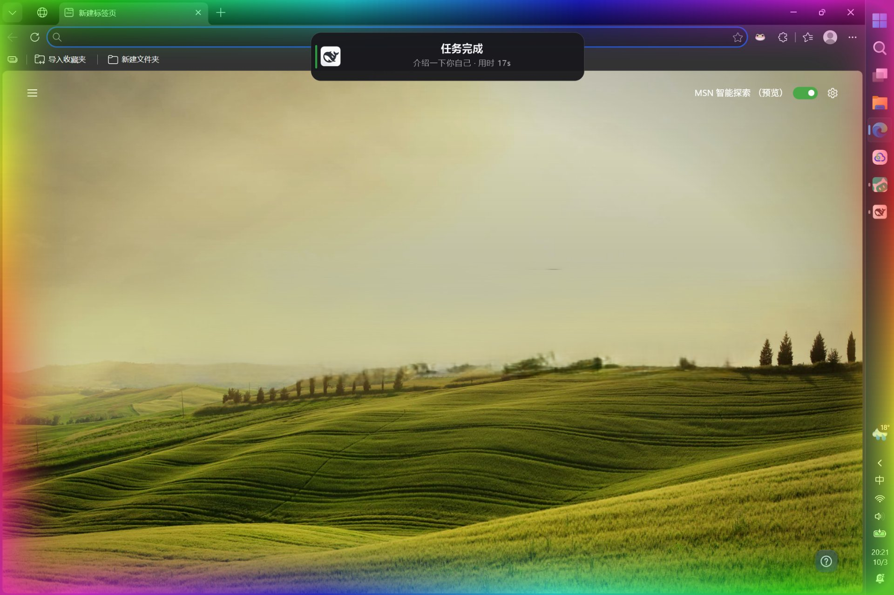

# dsh-donevoice 🔔

**DSH 的完成提醒官。** 你切去别的窗口干活时，DSH 里的任务**完成 / 等你审批 / 等你回答 / 执行失败**，它就用**整屏彩色流光边框 + 顶部卡片**（或 Windows 系统通知）+ 一声提示音叫你——**点一下就回到那个会话**。



## 功能

| | 什么时候提醒 | 通知内容 |
|---|---|---|
| 🟢 | **任务完成** | 「任务完成」+ 会话名 + 本次耗时 |
| 🟡 | **等你审批** | 「等待你的许可」+ 工具名 + 理由 |
| 🔵 | **等你回答** | 「需要你的回答」+ 第一个问题 |
| 🔴 | **执行失败** | 「执行失败」+ 错误摘要；提示音是**下行**的，一听就知道不对 |

- **点通知 = 回到那个会话**，DSH 没在跑就帮你启动它。
- **DSH 最小化、切走、标签被冻住，都照样能收到**；但**正看着 DSH 时不弹系统通知**，切走之后才弹。
- 子代理**不提醒**（会刷屏），只由主管会话提醒一次。

### 两种提醒形态（设置里随时切换，默认「页内卡片」，两者是替代关系）

| 你的状态 | 页内卡片（默认） | 顶部提醒 |
|---|---|---|
| **正看着 DSH** | 右下角弹卡片（可堆叠） | 整屏彩色边框 + 屏幕上方中间弹卡片 |
| **切走 / 最小化** | 系统通知 + 音效 | 整屏彩色边框 + 顶部卡片 + 音效 |

顶部提醒的边框有三个可调量：**羽化 / 浓度 / 流速**。亮多久跟着提示音走，换音效就是改时长。

切走时弹出的系统通知长这样：


## 快速开始

**1. 安装** —— DSH → **设置 → 插件 → 添加插件**，粘这一行：

```
github:zywnb-2/dsh-donevoice#v1.2.0
```

> **`#` 后面的版本号别删**，它把安装锁到对应的发布 tag；不写就跟随随时会变的 `main`。

**2. 重启 DSH。**

**3. 打开「设置 → 提醒 → 总开关」** —— ⚠️ **默认是关的**。「装了没反应」九成是因为它没开。


**4. 切到别的窗口**，让 DSH 跑个任务，看效果。

> 第一次提醒可能**慢约 2 秒**（要加载提示音），之后就几乎瞬时。

## 版本与要求

**仅 Windows 10 / 11**，DSH 桌面版 **0.2.0-rc.2**，不需要管理员权限。

| DoneVoice | 对应 DSH |
|---|---|
| **1.2.0** | 0.2.0-rc.2 |

升级：插件页卸载旧版 → 装新版（只改 `#` 后面那串）→ 重启 DSH。

## 卸载

在 DSH 的内置插件列表里移除该插件，重启 DSH。

## 许可

MIT。自带提示音来自 Pixabay，可免费商用、无需署名。
